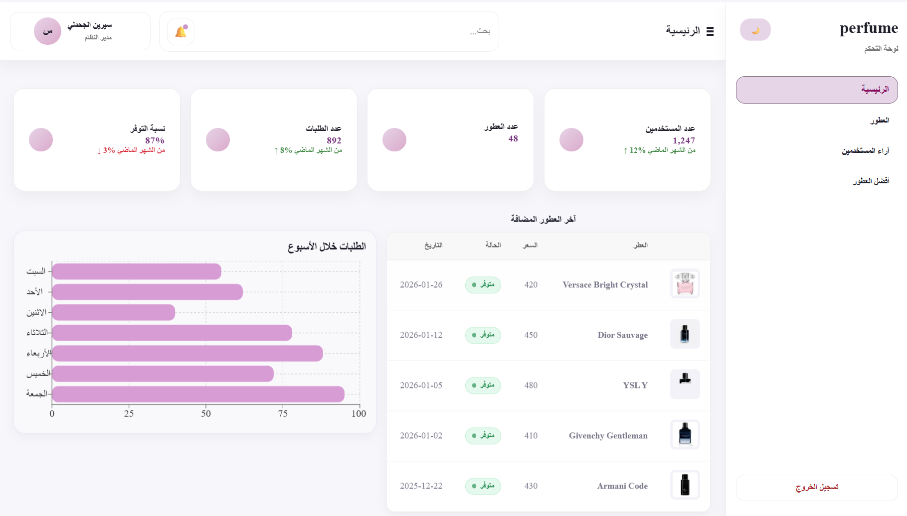
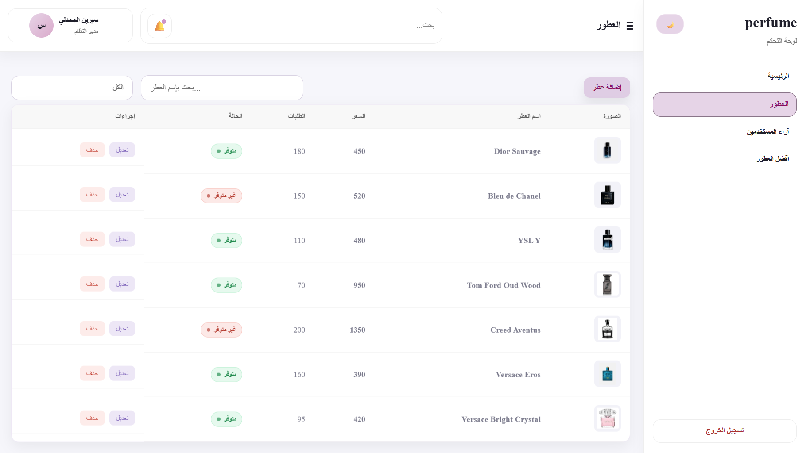

# Perfume Dashboard

A React-based admin dashboard for managing perfumes through a clean and responsive interface.

This project was developed to practice building a real-world dashboard application using React, focusing on CRUD operations, filtering, responsive UI design, and state management.

---

## Live Demo

https://cerine0205.github.io/perfume-dashboard/

---

## Demo Login

Email: admin@hashplus

Password: 12345678

---

## Screenshots

### Dashboard

The main dashboard provides an overview of the perfume management system, including statistics, recent perfumes, and quick access to management features.



### Perfume Management

Manage perfumes through Create, Read, Update, and Delete (CRUD) operations with search and filtering capabilities.



### Dark Mode

The dashboard includes a dark mode to improve usability and provide a better user experience.


---

## Features

- Create, edit, and delete perfumes
- View the latest added perfumes
- Search perfumes by name
- Filter perfumes
- Display customer reviews and ratings
- Dynamic "Top Perfumes" section
- Responsive dashboard layout
- Dark mode support

---

## Tech Stack

### Frontend

- React
- Vite
- JavaScript
- HTML5
- CSS3

### Data

- Mock API (used to simulate backend CRUD operations)

---

## Project Purpose

The goal of this project was to strengthen my React development skills by building an admin dashboard similar to those used in real-world web applications.

During this project, I practiced:

- Component-based architecture
- State management
- CRUD operations
- Search and filtering
- Responsive UI development
- Working with a Mock API

---

## Project Structure

```text
src/
├── components/
├── pages/
├── assets/
├── services/
├── hooks/
└── App.jsx
```

---

## Installation

Clone the repository:

```bash
git clone https://github.com/cerine0205/perfume-dashboard.git
```

Navigate to the project directory:

```bash
cd perfume-dashboard
```

Install dependencies:

```bash
npm install
```

Run the development server:

```bash
npm run dev
```

---

## Future Improvements

- Connect the application to a Laravel REST API
- Add user authentication and authorization
- Support image uploads
- Add pagination
- Improve dashboard analytics
- Implement user roles and permissions

---

## Author

Cerine

GitHub:
https://github.com/cerine0205
