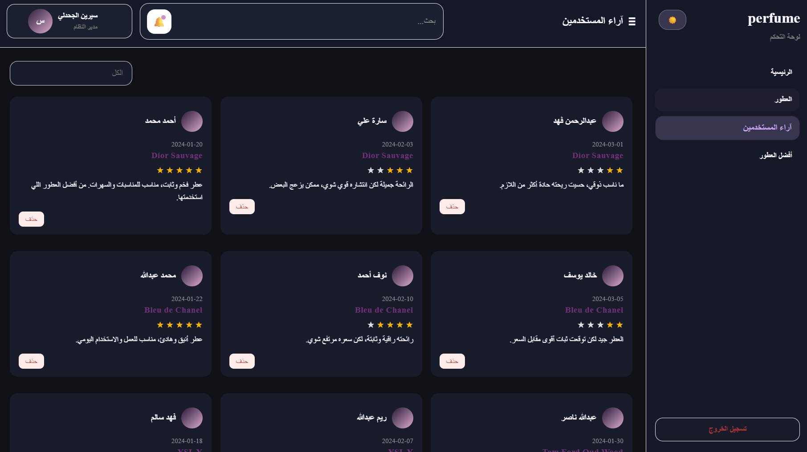

# Perfume Dashboard

A React-based admin dashboard for managing perfumes through a clean and responsive interface.

This project was built to practice developing a real-world admin panel with CRUD operations, search and filtering, dynamic UI updates, and responsive UI design.

## Screenshots

### Dashboard


### Perfume Management


### Dark Mode



---

## Live Demo

https://cerine0205.github.io/perfume-dashboard/

---

## Demo Login

Email: admin@hashplus

Password: 12345678

---

## Features

- Create, edit, and delete perfumes (CRUD)
- View the latest added perfumes
- Search perfumes by name
- Filter perfumes
- Display customer reviews and ratings
- Dynamic "Top Perfumes" section
- Responsive dashboard layout
- Dark Mode support

---

## Tech Stack

### Frontend

- React
- Vite
- JavaScript
- HTML5
- CSS3

### Data

- Mock API (used to simulate backend CRUD operations)

---

## Project Purpose

The goal of this project was to strengthen my React development skills by building an admin dashboard that simulates a real-world management system.

During this project, I practiced:

- Component-based architecture
- State management
- CRUD operations
- Search and filtering
- Responsive UI design
- Mock API integration

---

## Project Structure

```text
src/
├── components/
├── pages/
├── assets/
├── services/
├── hooks/
└── App.jsx
```

---

## Getting Started

Clone the repository

```bash
git clone https://github.com/cerine0205/perfume-dashboard.git
```

Install dependencies

```bash
npm install
```

Run the development server

```bash
npm run dev
```

---

## Future Improvements

- Connect the dashboard to a Laravel REST API
- Authentication and authorization
- Image upload support
- Pagination
- Dashboard analytics
- User roles and permissions

---

## Author

Cerine

GitHub: https://github.com/cerine0205
